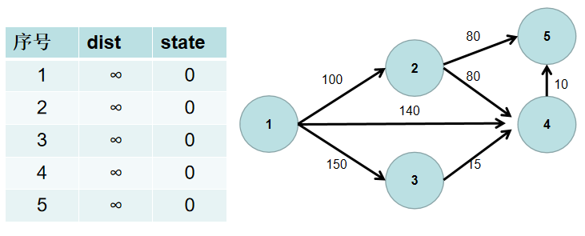
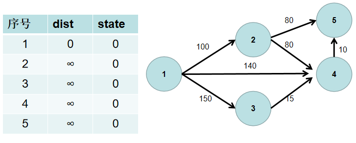
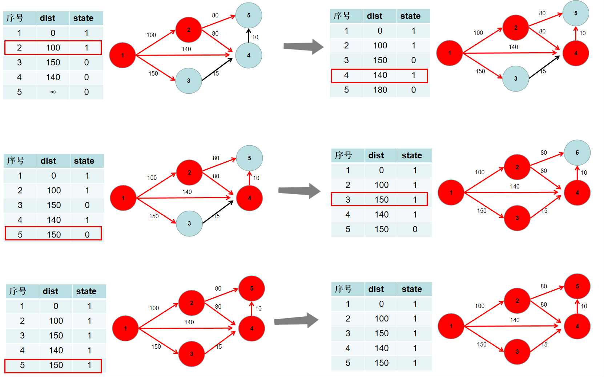

> 前言：Dijkstra 算法有朴素版和堆优化版。假设节点数量为 n，边的数量为 m。那么朴素版 Dijkstra 的时间复杂度为 O(n^2^)，堆优化版的时间复杂度为 O(mlogm)。因此，**当图为稠密图时，使用朴素版，当图为稀疏图时，使用堆优化版**。

# Dijkstra

算法流程如下：

1. 用一个 dist 数组保存源点到其余各个节点的距离，dist[i] 表示源点到节点 i 的距离。初始时，dist 数组的各个元素为无穷大。
	用一个状态数组 state 记录是否找到了源点到该节点的最短距离，state[i] 如果为真，则表示找到了源点到节点 i 的最短距离，state[i] 如果为假，则表示源点到节点 i 的最短距离还没有找到。初始时，state 各个元素为假。
	
2. 源点到源点的距离为 0。即dist[1] = 0。
	
3. 遍历 dist 数组，找到一个节点，这个节点是：没有确定最短路径的节点中距离源点最近的点。假设该节点编号为 i。此时就找到了源点到该节点的最短距离，state[i] 置为 1。
	
4. 遍历 i 所有可以到达的节点 j，如果 dist[j] 大于 dist[i] 加上 i -> j 的距离，即 dist[j] > dist[i] + w（w 为 i -> j 的距离） ，则更新 dist[j] = dist[i] + w。
	
5. 重复 3 4 步骤，直到所有节点的状态都被置为 1。
	
6. 此时 dist 数组中，就保存了源点到其余各个节点的最短距离。
	

算法思想：

Dijkstra 算法思想简单来说就是将图中所有节点分为了**已确定最短路**和**未确定最短路**的两个部分，每次循环都从**未确定最短路**的节点当中找到距离**已确定最短路**节点集合最近的那个节点，将其加入已确定的集合中，然后用它的最短路去更新与它相邻的**未确定最短路**的节点的距离。

当所有节点都加入了**已确定最短路**的节点集合时，就说明图中任意两点可达。如果存在**未确定最短路**的节点，说明该节点孤立。


# 题目

[LeetCode 743](https://leetcode.cn/problems/network-delay-time/description/)

题目简单来说就是，给定一个有向带权图，找到从一个点 `k` 出发，到图中其它所有节点的最短路径的最大值（距离 `k` 最远的节点的距离）。如果有任意节点不能达到，则返回 `-1`。


# 朴素版（稠密图）

```java
class Solution {
    public int networkDelayTime(int[][] times, int n, int k) {
        // 朴素版dijkstra
        int INF = Integer.MAX_VALUE / 2;
        // 邻接矩阵建图
        int[][] g = new int[n][n];
        for (int[] row : g) {
            Arrays.fill(row, INF);
        }
        for (int i = 0; i < times.length; i++) {
            g[times[i][0] - 1][times[i][1] - 1] = times[i][2];
        }

        // 初始化
        int ret = 0;
        int[] dist = new int[n];
        for (int i = 0; i < n; i++) dist[i] = INF;  // dist[i] 表示从k到i的最短路径
      	dist[k - 1] = 0;
        boolean[] vis = new boolean[n];  // 记录已确定节点和未确定节点
        while (true) {
            int x = -1;  // 所有未确定最短路的节点中，路径最短的那一个
            for (int i = 0; i < n; i++) {
                if (!vis[i] && (x == -1 || dist[i] < dist[x])) x = i;
            }
            if (x == -1) return ret;  // 所有节点都确定完了，返回结果
            if (dist[x] == INF) return -1;  // x节点没有确定最短路，且无法到达
          	// 如果是求 start 到 end 的最短距离，应该这么写：
          	// if (x == -1 || dist[x] == INF) return -1;
          	// if (x == end) return dist[x];
            ret = dist[x];
            vis[x] = true;
            for (int y = 0; y < n; y++) {
                dist[y] = Math.min(dist[y], dist[x] + g[x][y]);
            }
        }
    }
}
```


# 堆优化版（稀疏图）

```java
class Solution {
    public int networkDelayTime(int[][] times, int n, int k) {
        // 堆优化dijkstra，适用于邻接表
        int m = times.length;
        int[] he = new int[n + 10], e = new int[m], t = new int[m], ne = new int[m];
        int idx = 0;
        Arrays.fill(he, -1);
        for (int[] time : times) {
            int u = time[0], v = time[1], w = time[2];
            e[idx] = v;
            t[idx] = w;
            ne[idx] = he[u];
            he[u] = idx++;
        }

        // dijkstra
        int INF = Integer.MAX_VALUE / 2;
        int ret = 0;
        int count = n;  // 已确定最短路节点的数量
        PriorityQueue<int[]> pq = new PriorityQueue<>((a, b) -> (a[0] - b[0]));
        int[] dist = new int[n];
        Arrays.fill(dist, INF);
        dist[k - 1] = 0;
        pq.offer(new int[]{0, k});
        while (!pq.isEmpty()) {
            int[] temp = pq.poll();
            int x = temp[1], dx = temp[0];
          	// 一个节点可能多次重复入队，只有第一次出队的才有效，剪枝
            if (dx > dist[x - 1]) continue;  
            count--;
            ret = dx;
            for (int i = he[x]; i != -1; i = ne[i]) {
                int j = e[i], weight = t[i];
                if (dx + weight < dist[j - 1]) {
                    dist[j - 1] = dx + weight;
                    pq.offer(new int[]{dx + weight, j});
                }
            }

        }

        return count == 0 ? ret : -1;
    }
}
```

