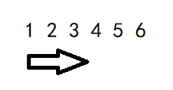
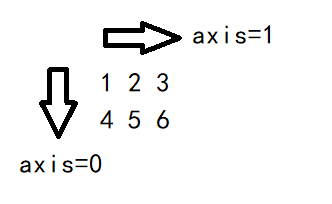
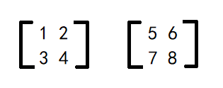
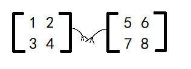

> 最近总有朋友问我关于Numpy库中的axis参数到底是什么意思？寥寥草草解释一番，估计作用也不大，遂写下此文详细谈谈我对于axis参数的理解，以及为什么大家在初次接触到axis参数的时候老是进入误区的原因。

# axis是什么意思？🤔

对 `axis` 的理解，就想它本来的意思一样——“轴”，但是强调的是**轴的方向**，即沿着哪一个轴的**方向**，理解**方向**这个概念十分重要。

`axis` 是对数组层级的刻画，取值范围取决于数组的维度。如果数组是一维，那么 `axis` 只能取0（很好理解吧，一维就是一条线，线只有一个方向吧）；如果数组是二维，那么 `axis` 可以取0或者1，依此类推……

# axis的误区

当 `axis` = 0 的时候，常常也能听到这样一种说话：按行的方向。其实我是不建议这么说的，尤其是对于刚刚接触 `axis` 这个参数的 player。因为谈到行，往往会先入为主地在脑海中想象出如下图这样类似的东西，再加上大脑的联想，就自然而然地认为是图中箭头所指的方向。



但是，这种想法其实是**错误的**。前面说过，`axis` 是对数组层级的刻画，简单来说，对于一个二维数组，如果 `axis` = 0，意思是**沿着第1行、第2行……第n行**这个方向，第几行就是对行的层级的刻画。但是如果将 `axis` = 0 描述为按行的方向，就很容易陷入上面所说的误区，对吧？



# 示例

这里再多解释一点，Numpy中二维的ndarray对象也常常叫做矩阵，区别就是矩阵是数学上的概念，而数组是程序设计中的概念。二者表述的其实是同一个东西。

下面用程序代码来具体演示一下 `axis` 的使用：

```python
# 首先创建两个2维的矩阵
n1 = np.array([[1, 2], [3, 4]])
n2 = np.array([[5, 6], [7, 8]])
```

创建出来的两个矩阵如下：



如果要将 n1 和 n2 两个矩阵按照叠罗汉的方式拼接起来，叠罗汉有最高层和最底层，抽象成矩阵分别对应的就是第一行和最后一行，也就是对行的层级的描述。因此也就是 `axis` = 0 的方向（再次再次强调一下：对于axis的理解在于“方向”二字）。因此拼接矩阵的代码如下：

```python
res0 = np.append(n1, n2, axis=0)
```

如果要将 n1 和 n2 两个矩阵按照手牵手的方式拼接起来，也就是如图中这样。那么也就有了最左边和最右边的区别，抽象成矩阵也就是第一列和最后一列，即对列的层级的描述，因此参数 `axis` 应该为 1。



代码如下：

```python
res1 = np.append(n1, n2, axis=1)
```


- 最后，完整的代码即测试输出如下：

```python
n1 = np.array([[1, 2], [3, 4]])
n2 = np.array([[5, 6], [7, 8]])
print(f"n1:\n{n1}")
print(f"n2:\n{n2}")
res0 = np.append(n1, n2, axis=0)
res1 = np.append(n1, n2, axis=1)
print(f"res0:\n{res0}")
print(f"res1:\n{res1}")
""" output:
n1:
[[1 2]
 [3 4]]
n2:
[[5 6]
 [7 8]]
res0:
[[1 2]
 [3 4]
 [5 6]
 [7 8]]
res1:
[[1 2 5 6]
 [3 4 7 8]]
"""
```