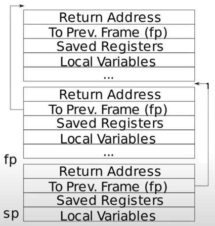
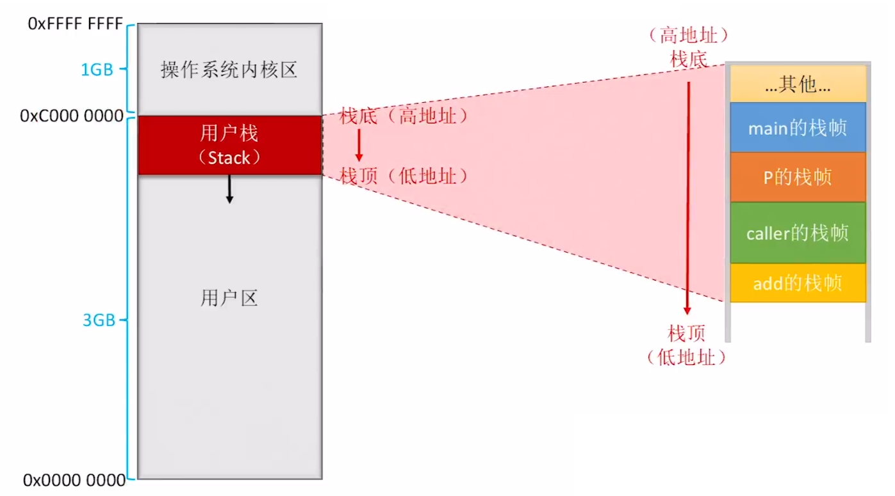

> 最近在学习MIT6.S018时，对栈帧的理解及切换过程的学习遇到了困难。在网上找了很多资料，最终看到了一个视频，以x86为基础分析了栈帧的切换过程。遂写下此文记录一下自己的理解，并举一反三，理解XV6中的栈帧结构及其切换过程。

# XV6中栈结构

下图是XV6中栈的简单结构图，其中每一个区域都是一个 Stack Frame（栈帧），每执行一次函数调用就会产生一个Stack Frame。



# x86中栈结构

x86中函数调用栈在内存中的位置如下图所示。通常来说，栈的最上面（栈底）为高地址，最下面（栈顶）为低地址，这样规定是因为与内存的结构有关。



# x86中栈的切换

下面给出一段执行函数调用的汇编代码，然后根据这段汇编代码来分析栈帧创建及其销毁的完整流程，并将x86中栈帧的创建与XV6中的栈帧结构图作对比，我们将发现其基本一致。下面给出两个函数的汇编代码，分别是 caller 函数和 add 函数，在 caller 函数中将调用 add 函数。

```assembly
caller:
push ebp
mov ebp,esp
sub esp,24
mov [ebp-12],125
mov [ebp-8],80
mov eax,[ebp-8]
mov [esp+4],eax
mov eax,[ebp-12]
mov esp,eax
call add
mov [ebp-4],eax
mov eax,[ebp-4]
leave
ret
```

```assembly
add:
push ebp
mov ebp,esp
mov eax,[ebp+12]
mov edx,[ebp+8]
add eax,edx
leave
ret
```

该汇编代码中所涉及到的与栈帧有关的寄存器的作用说明如下：

1. ebp（XV6中为fp），基址指针寄存器，该指针指向最新的一个栈帧的底部，即栈的高地址处。
2. esp（XV6中的sp），栈指针寄存器，该指针指向最新的一个栈帧的顶部，即栈的低地址处。ebp和esp就共同定义了一个栈帧的范围。

假设当前执行到了 `call add` 这条指令，此时 IP 寄存器中存放下一条指令，也就是 `mov [ebp-4], eax` 的地址，当前栈中存放的内容如下图1。接下来 `call add` 指令将 IP 寄存器的旧址压栈保存（相当于 `push ip`），然后设置 IP 寄存器的新值为 `push ebp` 指令的地址，也就是 add 函数第一条指令的地址。`push ip` 指令首先将 esp 寄存器中的地址减4，因为栈底在内存高地址处，所以增加栈通常是对 esp 做减法。然后将 IP 寄存器中的内容（下一条要执行指令的地址）存放到 esp 寄存器中的地址处，注意这里的 esp 寄存器和 IP 寄存器都是存放的指令地址。**这与XV6中栈帧的底部首先存放的是返回地址类似，即下一条要执行指令的地址，将在函数返回时存放到 IP 寄存器中**。执行之后的栈结构如下图2。

.png)

.png)

此时 IP 寄存器中的地址为 `push ebp` 指令的地址，接下来执行该条指令，IP 寄存器中的地址变为下一条指令的地址，即 `mov ebp,esp` 指令的地址。 `push ebp`  同样首先将 esp 寄存器中的地址减4，然后将 ebp 寄存器中的内容（此时为 0xA00F 0030）保存到 esp 所指向的地址，这在XV6中栈帧第二个位置存放上一个栈帧的 fp 相对应。

.png)

下面执行 `mov ebp,esp` 这条指令，同时将下一条指令 `mov eax,[ebp+12]` 的地址保存到 IP 寄存器中。 `mov ebp,esp` 指令将 esp 寄存器中的值移动到 ebp 寄存器中，也就是将 ebp 指向和 esp 相同的地址处。这里的 `push edp` 和 `mov eax,[ebp+12]` 这两条指令也可以归纳为一条 `enter` 指令，总得来说，`push ebp` 用来保存上一层函数的栈帧基址，`mov ebp,esp` 用来设置当前函数的栈帧基址。

.png)

接下来就执行该 add 函数中具体的内容，假设执行到 `leave`（IP 寄存器中存放的是 `leave` 指令的地址）时，栈结构如下图所示。

.png)

`leave` 指令用来执行函数返回，返回到函数调用的地方，等价于指令 `mov esp,ebp` 和 `pop ebp`。前者将栈顶指针指向与栈底指针相同的地方，后者将栈顶指针 esp 指向的内容 0xA00F 0030 赋给 ebp 寄存器，即将栈底指针指向调用函数的栈底处，然后将栈顶指针减4，此时的栈顶指针就指向了函数调用返回处的下一条指令的地址（将要放入 IP 寄存器中）。这样就完成了调用函数返回时栈帧的切换工作。

.png)

最后的 `ret` 指令就从栈帧顶部找到 IP 旧址，将其出栈并恢复 IP 寄存器，即将栈帧顶部的内容复制到 IP 寄存器中。这里与XV6中的栈帧结构有一点不同，XV6中栈帧的底部为函数返回地址，而在这里的x86中，函数的返回地址归到了上一个栈帧的顶部（绿色栈帧的低地址处）。

# 函数调用时栈帧切换小结

对于函数调用者来说，通过执行 `call` 指令调用函数，该指令将返回地址压入栈顶，并跳转到被调用函数的第一条指令。

对于被调用者来说，主要有以下几个步骤：

1. 首先要保存上一层函数栈帧，并设置当前函数栈帧，归纳为 `enter` 指令。
2. 一系列处理逻辑。
3. 恢复上一层函数的栈帧，使用 `leave` 指令。
4. 执行 `ret` 指令，从栈顶找到旧 IP 值，恢复 IP 寄存器。