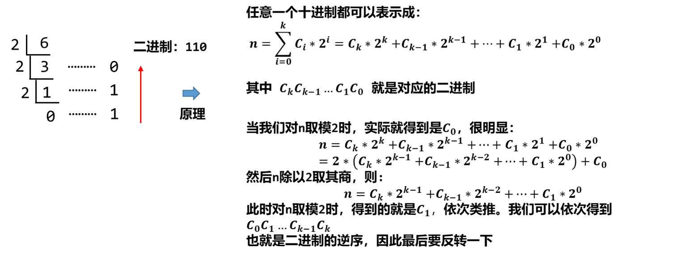
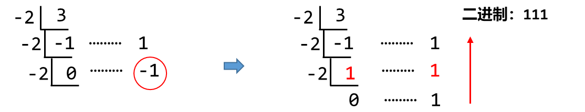

# 题目：

[LeetCode 1017](https://leetcode.cn/problems/convert-to-base-2/description/)

题目很简单，就是将一个十进制的数用**负二进制**表示。


# 进制转换

进制转换可以用辗转相除法。



对于 负二进制，我们同样可以用这个做法。但是由于是负数，我们在取余的时候，可能会出现负数。但是二进制是没有负数的，因此我们要将余数为负数修正为余数为正数，即将 -1 修正为 1，对应的商就应该增加 1。-1 修正为 1，相当于余数加了一个 2，那么商就要多减去一个 2，也就对应了商要 +1。




# 代码

```java
class Solution {
    public String baseNeg2(int n) {
        if (n == 0) return "0";
        StringBuilder ans = new StringBuilder();
        while (n != 0) {
            int mod = n % (-2);
            n = n / (-2);
            if (mod == -1) {
                mod = 1;
                n++;
            }
            ans.append(mod);
        }
        return ans.reverse().toString(); 
    }
}
```


