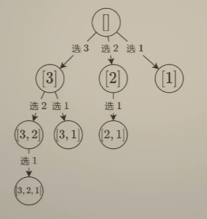

> 回溯按照常见的类型可以分为排列型回溯，子集型回溯和组合型回溯。此专题将分别讲解这三类常见回溯，并分别给出一道典型例题加以解释。注意：**永远将思想理解放在首位**。

# 回溯三问

回溯型的问题都可以按照以下三个问题来帮助思考，这是一种通用的思考回溯问题的套路：

1. 当前操作？
2. 子问题？
3. 下一个子问题？

# 排列型回溯

排列型回溯问题最经典的一题莫过于[全排列](https://leetcode.cn/problems/permutations/)了，排列型回溯和子集型回溯最大的区间就在于排列型回溯与顺序有关，而子集型回溯问题与顺序无关。

因此对于全排列这题来说，需要记录一下路径，来告诉后续操作还能够选择哪些数。例如设置一个 `path` 数组来记录当前选择的数，集合 `s` 存储当前可以选择的数。

以全排列这道题为例，按照回溯三问的过程来思考：

1. 当前操作？从 `s` 中枚举 `path[i]` 要填入的数字 `x`
2. 子问题？构造排列 `≥ i` 的部分，剩余未选数字集合为 `s`
3. 下一个子问题？构造排列 `≥ i + 1` 的部分，剩余未选数字集合为 `s - {x}`

Java 代码如下：

```java
class Solution {
    List<Integer> path = new ArrayList<>();  // 路径记录
    List<List<Integer>> ans = new ArrayList<>();
    
    public List<List<Integer>> permute(int[] nums) {
        int n = nums.length;
        Set<Integer> set = new HashSet<>();  // 剩余可选数字集合
        for (int num : nums) {
            set.add(num);
        }        
        dfs(0, n, set);
        return ans;
    }

    void dfs(int i, int n, Set<Integer> set) {
        if (i == n) ans.add(new ArrayList<>(path));
        Set<Integer> temp = new HashSet<>(set);  // 如果直接对set修改，会抛并发修改异常
        for (int num : set) {
            path.add(num);
            temp.remove(num);
            dfs(i + 1, n, temp);  // 下一个子问题
            path.remove(path.size() - 1);  // 回溯
            temp.add(num);  // 回溯
        }
    }
}
```


# 子集型回溯

子集型问题的本质是对于每个元素，是选还是不选。因此就可以从输入和输出两个角度出发来思考子集型回溯问题。

LeetCode 上一道经典的题为[子集](https://leetcode.cn/submissions/detail/529271698/)。

站在输入的角度来看，每个数可以选，也可以不选。按照回溯三问来思考：

1. 当前操作？枚举第 `i` 个数，选还是不选
2. 子问题？因为子集型回溯**与顺序有关**，因此只能从下标 `≥ i` 的数字中构造子集（而排列型回溯是以所有未选数组构造集合）
3. 下一个子问题？从下标 `≥ i + 1` 的数字中构造子集

Java 代码如下：

```java
class Solution {
    List<List<Integer>> ans = new ArrayList<>();

    public List<List<Integer>> subsets(int[] nums) {
        int n = nums.length;
        List<Integer> list = new ArrayList<>();
        dfs(nums, list, 0, n);
        return ans;
    }

    void dfs(int[] nums, List<Integer> list, int p, int n) {  // p表示当前考虑数的下标
        ans.add(new ArrayList<>(list));
        for (int i = p; i < n; i++) {
            list.add(nums[i]);
            dfs(nums, list, i + 1, n);
            list.remove(list.size() - 1);  // 回溯
        }
    }
}
```


站在输出，也就是答案的视角来看，每次必须选一个数，也就是枚举答案第一个数选谁，第二个数选谁……

1. 当前操作？枚举一个下标 `j ≥ i` 的数字，加入 `path`
2. 子问题？从下标 `≥ i` 的数字中构造子集
3. 下一个子问题？从下标 `≥ j + 1` 的数字中构造子集

Java 代码如下：

```java
class Solution {
    private final List<List<Integer>> ans = new ArrayList<>();
    private final List<Integer> path = new ArrayList<>();
    private int[] nums;

    public List<List<Integer>> subsets(int[] nums) {
        this.nums = nums;
        dfs(0);
        return ans;
    }

    private void dfs(int i) {
        ans.add(new ArrayList<>(path)); // 固定答案
        if (i == nums.length) return;
        for (int j = i; j < nums.length; ++j) { // 枚举选择的数字
            path.add(nums[j]);
            dfs(j + 1);
            path.remove(path.size() - 1); // 恢复现场
        }
    }
}
```


# 组合型回溯

[题目链接](https://leetcode.cn/problems/combinations/description/)

组合型回溯与顺序也无关，例如组合 `[a, b]` 和 `[b, a]` 为同一个组合。

将一个子集型回溯问题的搜索树画出来如下：



可以看到，第一层是元素个数为1的集合，第二层是元素个数为2的集合，第三层是元素个数为3的集合。因此，只需要在子集型回溯的基础上增加一个判断逻辑，也就是说，组合型回溯可以看成是长度固定的子集。

还是从输入和输出两个角度来写代码，从输入角度来看，也就是对于每个数选还是不选：

输出角度 Java 代码如下：

```java
class Solution {
    private int k;
    private final List<Integer> path = new ArrayList<>();
    private final List<List<Integer>> ans = new ArrayList<>();

    public List<List<Integer>> combine(int n, int k) {
        this.k = k;
        dfs(n);
        return ans;
    }

    private void dfs(int i) {
        int d = k - path.size(); // 还要选 d 个数
        if (d == 0) {
            ans.add(new ArrayList<>(path));
            return;
        }
        // 不选 i
        if (i > d) dfs(i - 1);
        // 选 i
        path.add(i);
        dfs(i - 1);
        path.remove(path.size() - 1);
    }
}
```


从输出角度来看就是枚举答案的下一个数字选哪个？输出角度 Java 代码如下：

```java
class Solution {
    private int k;
    private final List<Integer> path = new ArrayList<>();
    private final List<List<Integer>> ans = new ArrayList<>();

    public List<List<Integer>> combine(int n, int k) {
        this.k = k;
        dfs(n);
        return ans;
    }

    private void dfs(int i) {
        int d = k - path.size(); // 还要选 d 个数
        if (d == 0) {
            ans.add(new ArrayList<>(path));
            return;
        }
        for (int j = i; j >= d; --j) {
            path.add(j);
            dfs(j - 1);
            path.remove(path.size() - 1);
        }
    }
}
```


# 写在最后

以前一直都搞不清楚回溯和递归的区别，其实，回溯是一个增量构造答案的过程，而这个过程通常是用递归实现的。增量构造答案就是回溯的特点。
