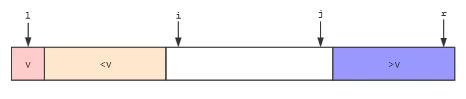
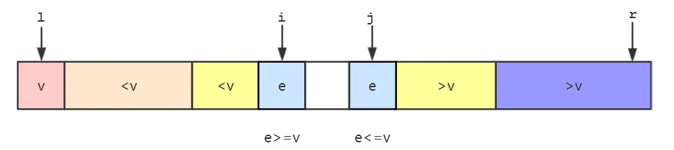
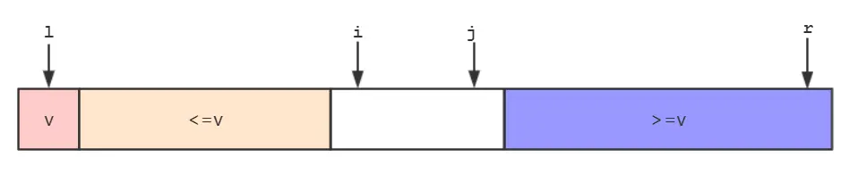
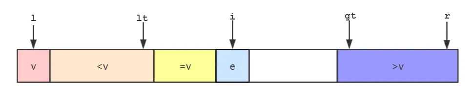
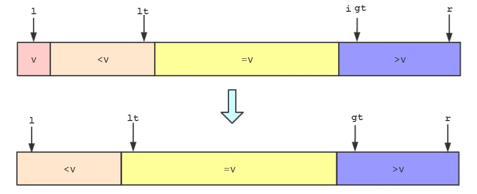

# 快排的思想

快排采用的是分治的思想，选取一个基准值 `pivot`，然后将所有小于 `pivot` 的元素放到其左边，将所有大于 `pivot` 的元素放到其右边（这个分割左右序列的过程一般称为 `patition`），然后对左部分序列和右部分序列重复以上过程。快排的核心在于 `pivot` 的选取，一个好的快排应当使得分割得到的左右序列长度大致相等。

以 [LeetCode 912](https://leetcode.cn/problems/sort-an-array/description/) 为例，给出快排的基础版本及其优化版本。

# 单路快排

单路快排将数组最右边的元素作为基准值 `pivot`，Java 代码如下：

```java
class Solution {
    public int[] sortArray(int[] nums) {
        quicksort(nums, 0, nums.length - 1);
        return nums;
    }

    // 该函数对数组进行分割得到左右序列
    // 选取数组最右侧元素作为pivot，使得左序列小于pivot，右序列大于 pivot
    int patition(int[] nums, int low, int high) {
        int pivot = nums[high];
        int i = low - 1;  // 小于等于i的元素都确定小于pivot
        for (int j = low; j <= high - 1; j++) {
            // j是下一个需要与pivot进行大小比较的元素
            if (nums[j] < pivot) {
                i++;
                swap(nums, i, j);
            }
        }
        // for循环结束时，i+1为pivot的位置
        swap(nums, ++i, high);
        return i;  // 返回pivot的位置，对左右序列进行递归调用
    }

    void quicksort(int[] nums, int left, int right) {
        if (left < right) {
            int pi = patition(nums, left, right);
            quicksort(nums, left, pi - 1);  // 左序列，小于pivot
            quicksort(nums, pi + 1, right);  // 右序列，大于等于pivot
        }
    }

    void swap(int[] nums, int a, int b) {
        int temp = nums[a];
        nums[a] = nums[b];
        nums[b] = temp;
    }
}
```


# 随机化快排

随机化快速排序的随机指的是每次分割数组时，随机选取 `pivot`。 Java 代码如下：

```java
class Solution {
    public int[] sortArray(int[] nums) {
        quicksort(nums, 0, nums.length - 1);
        return nums;
    }

    // 该函数对数组进行分割得到左右序列
    // 随机选取一个pivot，使得左序列小于pivot，右序列大于 pivot
    int patition(int[] nums, int low, int high) {
        int mid = new Random().nextInt(high - low + 1) + low;
        swap(nums, mid, high);
        int pivot = nums[high];
        int i = low - 1;  // 小于等于i的元素都确定小于pivot
        for (int j = low; j <= high - 1; j++) {
            // j是下一个需要与pivot进行大小比较的元素
            if (nums[j] < pivot) {
                i++;
                swap(nums, i, j);
            }
        }
        // for循环结束时，i+1为pivot的位置
        swap(nums, ++i, high);
        return i;  // 返回pivot的位置，对左右序列进行递归调用
    }

    void quicksort(int[] nums, int left, int right) {
        if (left < right) {
            int pi = patition(nums, left, right);
            quicksort(nums, left, pi - 1);  // 左序列，小于pivot
            quicksort(nums, pi + 1, right);  // 右序列，大于等于pivot
        }
    }

    void swap(int[] nums, int a, int b) {
        int temp = nums[a];
        nums[a] = nums[b];
        nums[b] = temp;
    }
}
```


# 双路快排

双路快排是对随机化快排的进一步优化。不难想象如果数组中存在大量重复元素，就有可能导致分割之后右部分序列长度很长，导致左右序列长度不平衡，在最坏的情况下时间复杂度会退化成 O(n^2^)。双路快排的过程如下：

1. 选取最左侧元素作为 `pivot`，也可以随机选取，随机选取之后将其与最左侧元素交换位置即可。以下用 `v` 代替 `pivot`。将 `<v` 和 `>v` 两部分放在数组的两端，用 `i` 指向 `<v` 部分的下一个元素，用 `j` 指向 `>v` 部分的前一个元素。



2. 从 `i` 开始向后遍历，如果遍历的元素 `e < v`，则继续向后遍历，直到遍历的元素 `e >= v`，则停止遍历。同样从 `j` 开始向前遍历，如果遍历的元素 `e > v`，则继续向前遍历，直到遍历的元素 `e <= v`，则停止遍历。



3. 交换 `i` 指向的元素和 `j` 指向的元素。然后 `i++`，`j--` 继续比较下一个。



Java 代码如下：

```java
class Solution {
    public int[] sortArray(int[] nums) {
        quicksort(nums, 0, nums.length - 1);
        return nums;
    }

    int patition(int[] nums, int left, int right) {
        swap(nums, left, new Random().nextInt(right - left + 1) + left);
        int v = nums[left];
        int i = left + 1, j = right;
        while (true) {
            while (i <= right && nums[i] < v) i++;
            while (j >= left && nums[j] > v) j--;
            if (i >= j) break;
            swap(nums, i, j);
        }
        // while结束后，j指向最后一个小于v的元素
        swap(nums, left, j);
        return j;
    }

    void quicksort(int[] nums, int left, int right) {
        if (left < right) {
            int pi = patition(nums, left, right);
            quicksort(nums, left, pi - 1);
            quicksort(nums, pi + 1, right);
        }
    }

    void swap(int[] nums, int a, int b) {
        int temp = nums[a];
        nums[a] = nums[b];
        nums[b] = temp;
    }
}
```


# 三路快排

三路快排即在双路快排的基础上，进一步将 `== v` 的部分拿出来单独作为第三个部分，三路快排的步骤如下：

1. 在双路快速排序的基础上，我们把等于 `v` 的元素单独作为一个部分。`lt` 指向小于 `v` 部分的最后一个元素，`gt` 指向大于 `v` 部分的第一个元素。



2. 从 `i` 开始向后遍历，如果遍历的元素 `e = v`，则`e`直接合并到 `= v` 部分，然后 `i++` 继续遍历。如果遍历的元素 `e < v`，则将 `e` 和 `= v` 部分的第一个元素（ `lt + 1` 指向的元素）交换，然后 `lt++`，`i++` 继续遍历。如果遍历的元素 `e > v`，则将 `e` 和 `> v` 部分前一个元素（ `gt - 1` 指向的元素）交换，然后 `gt--`，不过此时 `i` 不需要改变，因为 `i` 位置的元素是和 `gt` 位置前面的空白元素交换过来的。

3. 遍历完后 `i = gt` ，然后将 `l` 指向元素和 `lt` 指向元素交换。最终 `lt` 左侧的元素就小于 `v`，`[lt, gt)` 区间内的元素等于 `v` ，`gt` 及 `gt` 右侧的元素大于 `v`。



Java 代码如下：

```java
class Solution {
    public int[] sortArray(int[] nums) {
        quicksort(nums, 0, nums.length - 1);
        return nums;
    }

    void quicksort(int[] nums, int left, int right) {
        if (left >= right) return;
        swap(nums, left, new Random().nextInt(right - left + 1) + left);
        int v = nums[left];
        // [left+1, right] 进行排序
        int lt = left, gt = right + 1; 
        int i = left + 1;
        while (i < gt) {
            if (nums[i] < v) {
                swap(nums, i, lt + 1);
                lt++;
                i++;
            } else if (nums[i] > v) {
                swap(nums, i, gt - 1);
                gt--;
            } else {
                i++;
            }
        }
        swap(nums, left, lt);
        quicksort(nums, left, lt - 1);
        quicksort(nums, gt, right);
    }

    void swap(int[] nums, int a, int b) {
        int temp = nums[a];
        nums[a] = nums[b];
        nums[b] = temp;
    }
}
```

