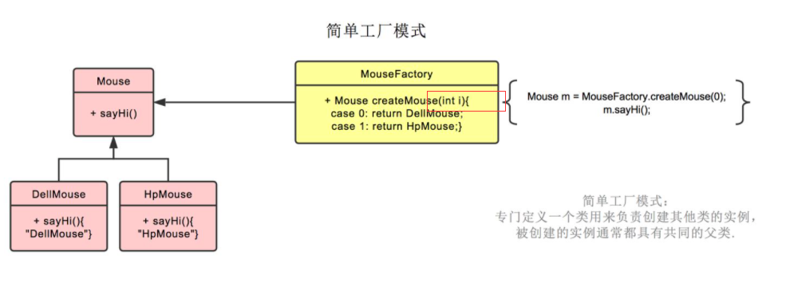
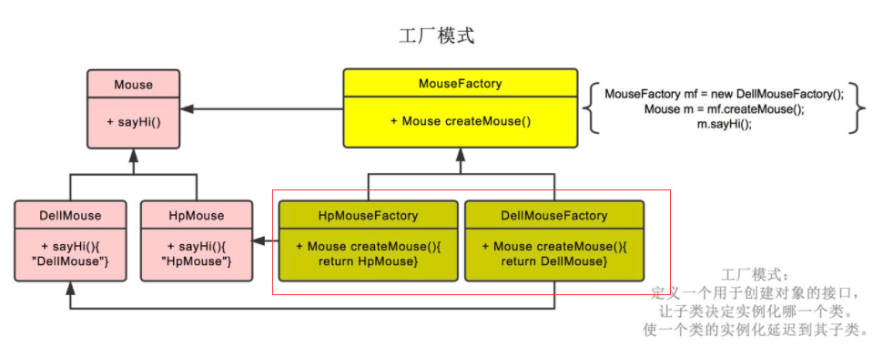
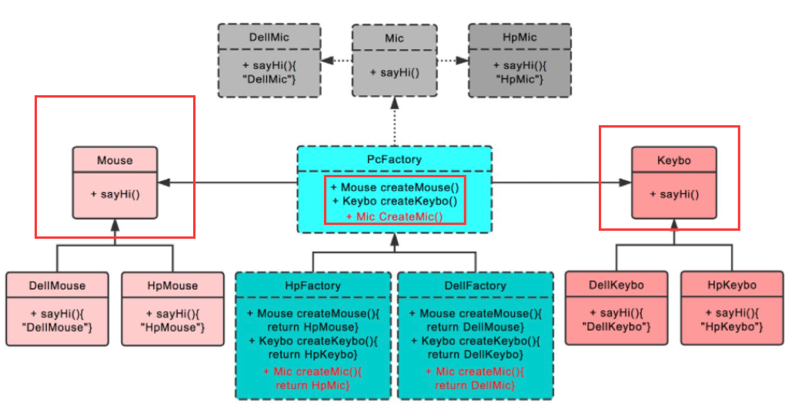

# 先说总结！

简单工厂模式，工厂方法模式和抽象工厂模式都是一种建造型方法，都满足**单一职责原则**（将产品创建代码放在程序的单一位置， 从而使得代码更容易维护）和**开闭原则**（无需更改现有客户端代码， 你就可以在程序中引入新的产品类型），它们的核心思想都是**将对象的实例化过程和使用解耦**开来。客户端只需要知道其接口，而无需知道其内部具体的业务逻辑。

简单工厂模式，工厂方法模式和抽象工厂模式，这三种模式的实现是层层递进的，都是依次对前面的补充。

# 简单工厂模式

简单工厂模式描述了一个类， 它拥有一个包含大量条件语句的构建方法， 可根据方法的参数来选择对何种产品进行初始化并将其返回。

例如下图所展示的一个鼠标工厂，在这个鼠标工厂中，通过传入一个 `int` 型的实例的代号来获得对应的实例。

这种设计方法的缺点很明显：

1. 需要传入一个代号参数指明想要的实例，每次新增实例，都需要对这个工厂类增加相应的业务逻辑；
2. 当系统中的具体产品类不断增多时候，可能会出现要求工厂类根据不同条件创建不同实例的需求．这种对条件的判断和对具体产品类型的判断交错在一起，又增加了系统的维护成本。

# 工厂方法模式

工厂方法模式的思想很简单暴力，为每一个产品类都分配一个负责它的实例化过程的工厂，也就是说，在父类中提供一个创建对象的方法， 允许子类决定实例化对象的类型。如果在基类及其扩展的子类中都有一个**构建方法**的话， 那它可能就是工厂方法。

这里的构建方法指的是创建对象的方法，或者说是构造函数调用的封装器。它可以让你的代码独立于构造函数的改动， 甚至还可以包含一些特殊的逻辑， 返回已有对象（缓冲区）而不是创建新对象。

由于每一个产品类都有自己的工厂，因此也就无需在工厂中传入一个参数来区分具体的产品类。在工厂中，只有一个创建对应的产品类的方法，因此叫做**“工厂方法”**。下面是一个演示工厂方法的说明图：

在上面的说明图中，所有的鼠标都有一个自己专属的创建工厂，每一个工厂类都有公共的父类。父类和子类都有一个构建方法。

和简单工厂模式相比，优势之处在于：

1. 创建产品类的时候只需要知道名字即可；
2. 扩展性高，符合开闭原则，新增一个产品类的时候只需要增加一个对应的工厂类，无需修改其他已有的工厂类（**这同时也是其缺点**，因为使得系统中类的数量成倍增长了）。

# 抽象工厂模式

抽象工厂模式是工厂方法模式的升级版本，他用来创建一系列相关或者相互依赖的对象。例如有这样一组的对象：  运输工具 + 引擎 + 控制器。 它可能会有几个变体：

1. 汽车 + 内燃机 + 方向盘
2. 飞机 + 喷气式发动机 + 操纵杆

下面这张图详细展示了抽象工厂的核心思想：

`PcFacotory` 就是一个抽象工厂，所有生产电脑的工厂类都继承于它，例如图中生产与惠普电脑相关的一系列产品的工厂类和生产与戴尔电脑相关的一系列产品的工厂类。每个工厂只负责同一类产品类的创建。

与工厂方法相比，需要新增产品类的时候只需要修改工厂对应的接口，然后让所有实现了这个接口的工厂类实现其新增的方法即可。大大减少类的数量的同时还提高了代码的可维护性。抽象工厂模式隔离了具体类的生成，使得客户并不需要知道什么被创建。由于这种隔离，更换一个具体工厂就变得相对容易，所有的具体工厂都实现了抽象工厂中定义的那些公共接口，因此只需改变具体工厂的实例，就可以在某种程度上改变整个软件系统的行为。

其缺点也很明显：增加新的产品等级结构时比较麻烦，需要对原有系统进行较大的修改，甚至需要修改抽象层代码。

# 使用场景

1. Spring 就是一个最大的 Bean 工厂，IoC 通过 FactoryBean 对 Bean 进行管理
2. 我们使用的日志门面框架 slf4j，点进去就可以看到熟悉的味道 `private final static Logger logger = LoggerFactory.getLogger(HelloWord.class);`而这里的工厂实现，通过类加载去获取，应用开发者根本不需要关心背后实现是什么。 项目维护人员维护好日志 jar 包和配置即可
3. JDK 的 Calendar 使用了简单工厂模式 `Calendar calendar = Calendar.getInstance();`
4. 数据库访问，当用户不知道最后系统采用哪一类数据库，以及数据库可能有变化时。就可以去设计一个工厂类，在类中提供各种数据库的实例对象
