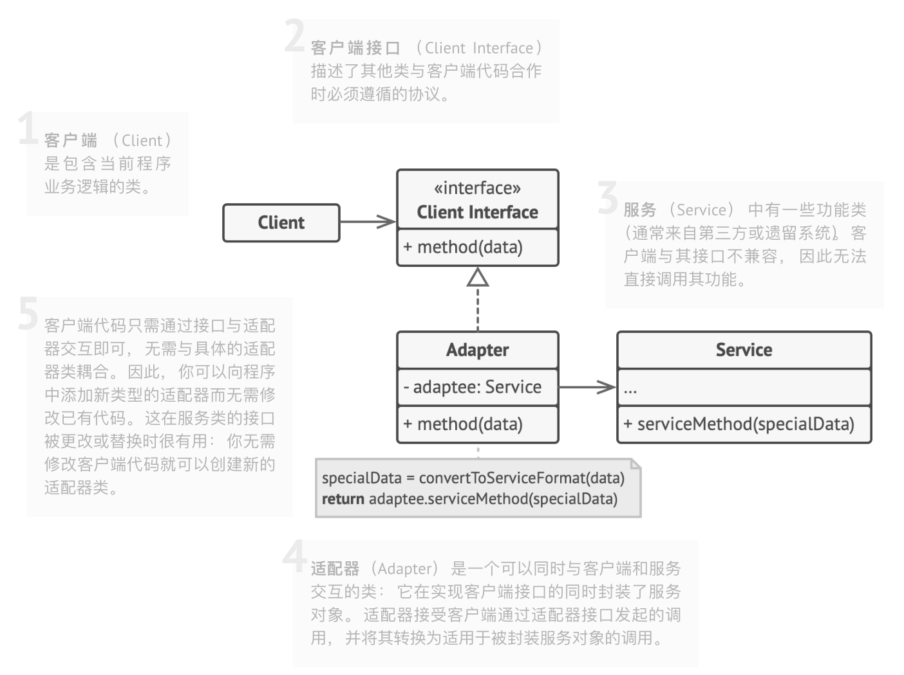
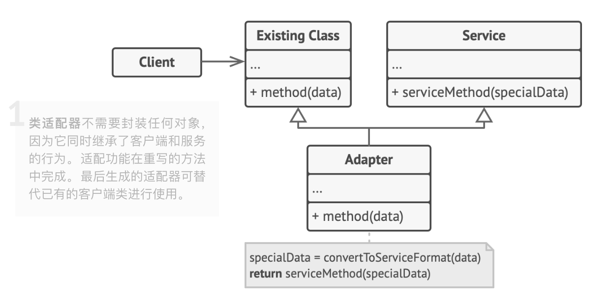

# 适配器模式

适配器模式是一种结构型设计模式， 它能使接口不兼容的对象能够相互合作。

一个最直观的例子就是手机电源适配器，它能将外部提供的电压转换为手机充电时的工作电压。适配器模式就是基于这种思想。

适配器模式在不同接口对象之间的运作方式为：

1. 适配器实现与其中一个现有对象兼容的接口。
2. 现有对象可以使用该接口安全地调用适配器方法。
3. 适配器方法被调用后将以另一个对象兼容的格式和顺序将请求传递给该对象。

适配器模式有两种，分别是**对象适配器**和**类适配器**。

## 对象适配器

构成原则： 对象适配器实现了其中一个对象的接口， 并对另一个对象进行封装。 所有流行的编程语言都可以实现适配器。

## 类适配器

类适配器的实现使用了继承机制： 适配器同时继承两个对象的接口。 请注意， 这种方式仅能在支持多重继承的编程语言中实现， 例如 C++。

# 适用场景

🌸 当使用某个类时，但是其接口与其他代码不兼容，可以使用对象适配器对该类进行适配。

🌸 如果需要复用这样一些类，他们处于同一个继承体系，并且他们又有额外的一些共同的方法，但是这些共同的方法不是所有在这一继承体系中的子类所具有的共性。将缺失功能添加到一个适配器类中是一种优雅得多的解决方案。然后将缺少功能的对象封装在适配器中，从而动态地获取所需功能。如要这一点正常运作，目标类必须要有通用接口，适配器的成员变量应当遵循该通用接口。这种方式同装饰模式非常相似。

# 优缺点

- 优点
	1. 单一职责原则：将接口或数据转换代码从程序主要业务逻辑中分离
	2. 开闭原则：只要客户端代码通过客户端接口与适配器进行交互， 你就能在不修改现有客户端代码的情况下在程序中添加新类型的适配器
- 缺点
	1. 代码复杂度增加，有时候直接更新服务类代码更容易
